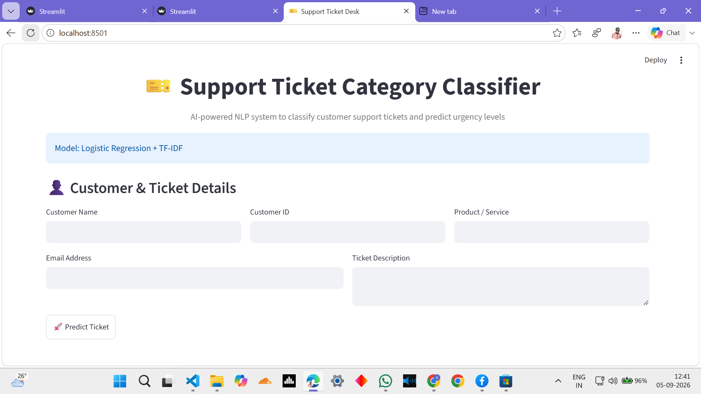

# 🎫 Support Ticket Category Classifier

## 📌 Project Overview

This project uses **Natural Language Processing (NLP)** and **Machine Learning** to automatically classify customer support tickets into different categories and predict ticket urgency levels.

The system helps support teams organize customer issues, identify priority tickets, and route requests to the appropriate department.

---

# 🚀 Features

- ✅ Customer support ticket classification
- ✅ Ticket urgency prediction (High / Medium / Low)
- ✅ Text preprocessing and cleaning
- ✅ TF-IDF text feature extraction
- ✅ Logistic Regression classification model
- ✅ Keyword-based urgency detection
- ✅ Interactive Streamlit web application
- ✅ Customer details and ticket summary dashboard

---

# 📂 Ticket Categories

The model predicts the following support ticket categories:

- Billing inquiry
- Cancellation request
- Product inquiry
- Refund request
- Technical issue

---

# 🤖 Machine Learning Approach

## Text Processing

Customer ticket descriptions are processed using:

- Lowercase conversion
- Removal of unwanted characters
- Text cleaning
- TF-IDF vectorization

## Classification Model

Machine Learning algorithm used:

### Logistic Regression

The model learns patterns from historical customer support tickets and predicts the most suitable category for a new ticket.

---

# ⚡ Urgency Prediction

Ticket urgency is predicted using keyword-based rules.

## High Urgency Keywords

Examples:

- urgent
- critical
- emergency
- not working
- cannot access
- crash
- blocked

## Medium Urgency Keywords

Examples:

- issue
- problem
- error
- payment
- refund
- transaction

## Low Urgency

General product questions and information requests.

---

# 🛠 Technologies Used

- Python
- Pandas
- NumPy
- Scikit-learn
- Natural Language Processing (NLP)
- TF-IDF Vectorization
- Logistic Regression
- Streamlit

---

# 📊 Model Performance

The final Logistic Regression model achieved:

| Metric | Score |
|--------|-------|
| Accuracy | 92% |
| F1 Score | 92% |

The model performance was evaluated using precision, recall, and F1-score metrics.

---

# 📁 Project Structure

```
Support-Ticket-Classifier/

│── app.py
│── Support_Ticket_Classifier.ipynb
│── customer_support_tickets.csv
│── ticket_classifier.pkl
│── tfidf_vectorizer.pkl
│── requirements.txt
│── README.md

└── screenshots/
    │── app_home.png
    │── prediction_result.png
```

---

# ▶️ How to Run

## 1. Clone Repository

```bash
git clone https://github.com/akshithasamudrala9515/Support-Ticket-Classifier.git
```

## 2. Install Dependencies

```bash
pip install -r requirements.txt
```

## 3. Run Streamlit Application

```bash
streamlit run app.py
```

---

# 🖥 Application Features

The Streamlit application provides:

- Customer information input
- Product/service details
- Ticket description analysis
- Automatic category prediction
- Urgency level detection
- Generated ticket summary

---

# 🔮 Future Improvements

Possible enhancements:

- Add sentiment analysis
- Add ticket history tracking
- Add analytics dashboard
- Add database integration
- Deploy application online
- Improve urgency prediction using ML models

---

# 👩‍💻 Developed By

## Akshitha Samudrala

**Computer Science and Engineering**

### Project:
Support Ticket Category Classifier

### Technologies:

NLP | Machine Learning | Streamlit | Python

### Model:

Logistic Regression + TF-IDF

---

# 📸 Application Screenshots

## Streamlit Interface




## Prediction Result


