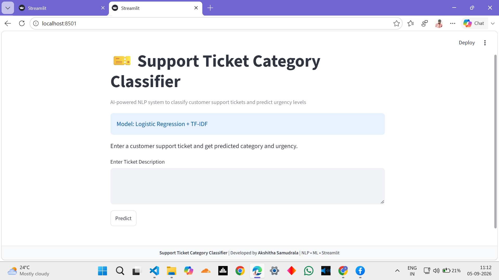
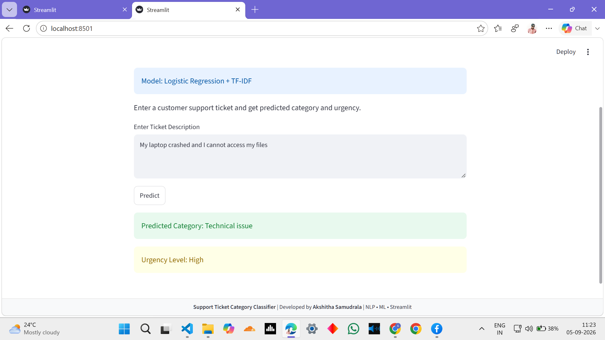

# 🎫 Support Ticket Category Classifier

## Project Overview

This project uses Natural Language Processing (NLP) and Machine Learning to automatically classify customer support tickets into different categories and predict ticket urgency levels.

The system helps support teams organize customer issues and route tickets to the appropriate department.

---

## Features

- Customer support ticket classification
- Ticket urgency prediction (High / Medium / Low)
- Text preprocessing and cleaning
- TF-IDF text feature extraction
- Logistic Regression machine learning model
- Keyword-based urgency detection
- Streamlit web application

---

## Ticket Categories

The model predicts the following support ticket categories:

- Billing inquiry
- Cancellation request
- Product inquiry
- Refund request
- Technical issue

---

## Machine Learning Approach

### Text Processing

The ticket text is processed using:

- Lowercase conversion
- Removal of unwanted characters
- Text cleaning
- TF-IDF vectorization

### Classification Model

Machine Learning model used:

**Logistic Regression**

The model learns patterns from customer support ticket descriptions and predicts the most suitable category.

### Urgency Prediction

Urgency is predicted using keyword-based rules:

- High urgency keywords:
  - urgent
  - critical
  - not working
  - cannot access
  - crash

- Medium urgency keywords:
  - issue
  - problem
  - error
  - payment
  - refund

- Low urgency:
  - General queries and information requests

---

## Technologies Used

- Python
- Pandas
- NumPy
- Scikit-learn
- Natural Language Processing (NLP)
- TF-IDF
- Logistic Regression
- Streamlit

---

## Model Performance

The final model performance: 

## Project Structure
Support-Ticket-Classifier/

│── app.py
│── ticket_classifier.pkl
│── tfidf_vectorizer.pkl
│── requirements.txt
│── README.md
│── Support_Ticket_Classifier.ipynb

---

---

## How to Run

### 1. Clone the repository

```bash
git clone https://github.com/akshithasamudrala9515/Support-Ticket-Classifier.git

### 2. Install dependencies
pip install -r requirements.txt

### 3. Run Streamlit application
streamlit run app.py


---

## Future Improvements

- Add sentiment analysis
- Add prediction confidence score
- Add ticket analytics dashboard
- Deploy application online
---

## 👩‍💻 Developed By

**Akshitha Samudrala**
**computer science and engineering**
**Project:** Support Ticket Category Classifier

**Technologies:**  
NLP | Machine Learning | Streamlit | Python

**Model:**  
Logistic Regression + TF-IDF

## Application Screenshots

### Streamlit Interface



### Prediction Example

